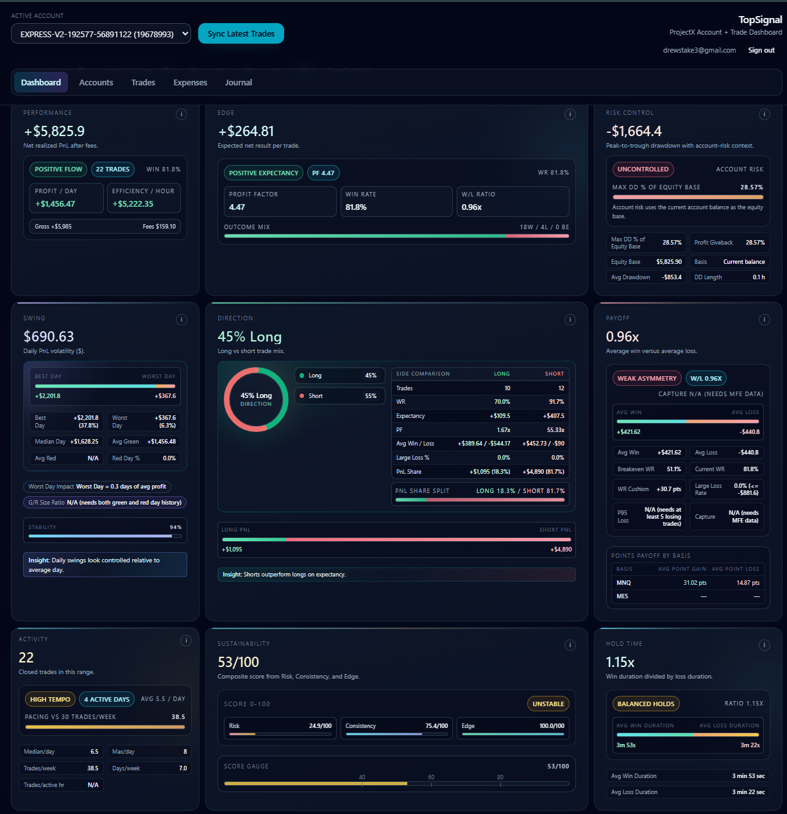
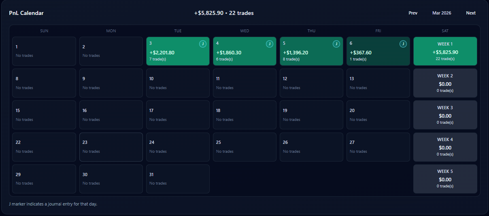
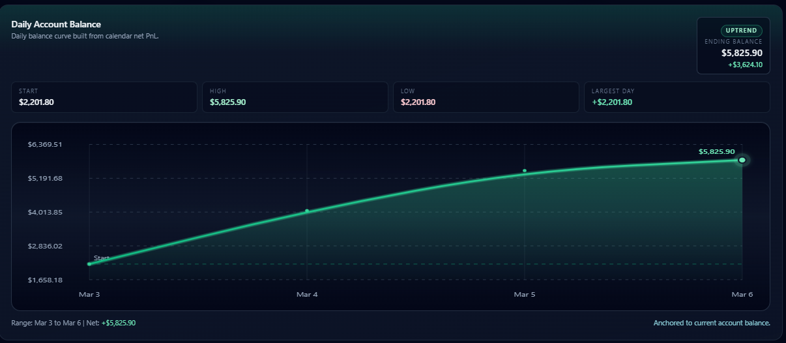
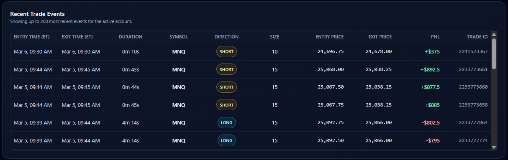
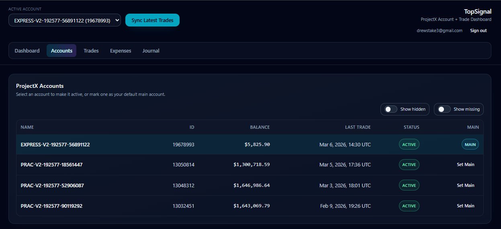
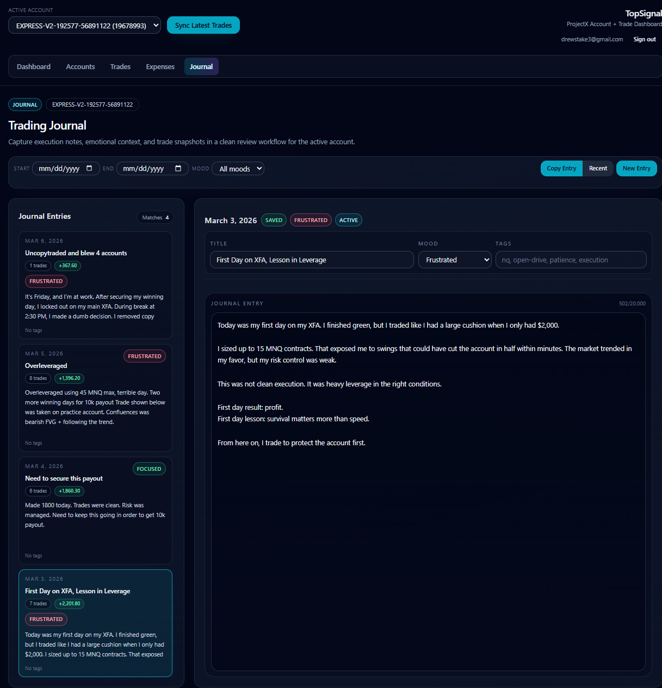
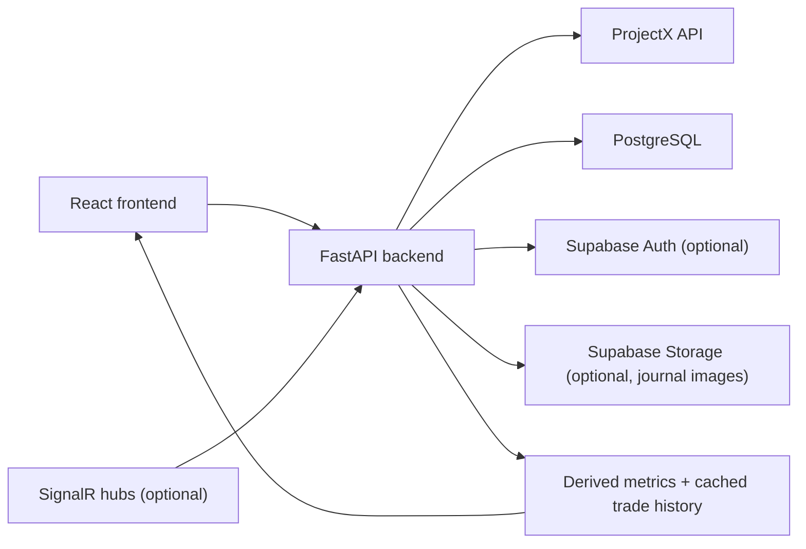

# TopSignal

TopSignal is a trading analytics and journaling application for ProjectX/TopstepX-style futures accounts. It syncs account and execution data from the provider, stores it in PostgreSQL, computes account-level performance and risk metrics, and presents those results in a React dashboard with account management, trade review, expense tracking, and a daily trading journal.

This repository contains:

- A React + TypeScript frontend in `frontend/`
- A FastAPI backend in `backend/`
- A PostgreSQL schema and raw SQL migrations in `db/`

## Why This Project Exists

ProjectX exposes account and trade data, but the raw provider API is not a good day-to-day analytics workspace by itself. TopSignal exists to solve that gap.

It is built for traders who want to:

- keep a local or cloud-backed history of their ProjectX trades
- analyze performance without re-querying the provider for every page load
- understand risk, drawdown, expectancy, and pacing in plain numbers
- journal trading days per account with autosave and trade-stat snapshots
- track real cash costs such as evaluation fees, activations, resets, and data fees

## What The App Does

At a high level, TopSignal:

1. pulls account and execution data from ProjectX
2. normalizes and stores it in PostgreSQL
3. derives account, trade, day, and behavior metrics from stored data
4. exposes those results through a FastAPI API
5. renders them in a frontend focused on trading review workflows

Core features in the current routed app:

- Account discovery and account-state tracking
- Main-account selection
- Manual trade sync from ProjectX
- Account-level performance summaries
- Trading-day PnL calendar
- Trade event feed with filtering and lifecycle-derived entry/exit fields
- Expense CRUD and totals
- Daily journal entries with autosave, optimistic concurrency, trade-stat pulls, and image uploads
- Optional Supabase authentication for multi-user deployments

## Product Walkthrough

### Dashboard

The dashboard is the main account analytics surface. It is account-scoped and shows:

- headline performance and edge metrics
- drawdown and risk-control context
- long-vs-short breakdowns
- payoff and activity metrics
- sustainability scoring
- a trading-day PnL calendar
- a daily account-balance curve derived from the calendar
- a recent trade-event feed

Dashboard overview:



Calendar drill-down:



Balance curve derived from the selected trading range:



Recent execution review feed:



Important dashboard behaviors:

- The active account comes from the global account picker in the app shell.
- The page can sync trades, change time range, and drill into a specific trading day.
- Clicking a PnL-calendar day filters the trade feed to that trading day.
- Calendar days can open or create a journal entry for that date/account.
- The dashboard uses `summary-with-point-bases` so it can render one summary request plus point-payoff comparisons instead of fanning out multiple summary calls.

### Accounts

The Accounts page is the account-management surface for ProjectX accounts.

A user can:

- view discovered accounts
- see current balance, state, and last known trade timestamp
- toggle hidden and missing accounts into view
- mark one account as the main account
- set the active account used across the rest of the app
- merge journal history from an older account into a replacement account
- resolve the last trade timestamp from the provider when local data is stale or absent

Accounts page:



TopSignal tracks four account states:

- `ACTIVE`: visible and tradable
- `LOCKED_OUT`: account exists but cannot trade
- `HIDDEN`: provider returned it as not visible
- `MISSING`: previously seen, now absent from provider results after a buffer window

### Trades

The Trades page is the execution-review surface.

A user can:

- filter trades by date range
- filter trades by symbol text
- choose a row cap
- refresh data from the local cache
- explicitly sync the selected date window from ProjectX
- inspect summary metrics for the filtered window
- review trade events with inferred entry time, exit time, duration, entry price, exit price, and PnL

If an account is currently `MISSING`, the page still shows locally stored data and does not claim live provider sync is available.

### Expenses

The Expenses page tracks paid account costs and operational costs.

A user can:

- create, list, filter, paginate, and delete expenses
- group spend by date range and category
- track evaluation fees, activation fees, reset fees, data fees, and other costs
- optionally associate an expense with an account, plan size, and account type

The page also contains a combine spend helper that:

- infers active combine accounts from account-name prefixes
- keeps a client-side spend ledger in browser storage
- can sync inferred evaluation purchases into the `expenses` table

This combine tracker is implemented on the frontend and is not a standalone backend subsystem.

### Journal

The Journal page is an account-scoped daily trading journal.

A user can:

- create one journal entry per account per date
- filter entries by date range, mood, and text query
- edit title, mood, tags, and notes
- rely on debounced autosave
- archive or unarchive entries
- paste images into the entry workspace
- pull a trade-stat snapshot into the journal entry
- merge one account's journal history into another account without deleting the source account history

Journal workspace:



Notable journal behavior:

- Autosave uses optimistic concurrency with a `version` column.
- If a stale save collides with newer server state, the API returns `409 version_conflict` and the UI can reload the server version.
- Journal images are stored either locally on disk or in Supabase Storage, depending on configuration.
- Trade stats can be pulled by explicit trade IDs, explicit date range, or the entry's trading day.
- Journal merge matches entries by `entry_date`. `skip` keeps the destination entry for that date; `overwrite` replaces the destination entry content with the source entry.
- Journal merge copies entries into the destination account and leaves the source account untouched. When image copying is enabled, new destination image records and files are created so source images are not orphaned or shared.

### Not Currently Routed

The repository also contains `overview/` and `analytics/` pages, but they are not wired into the current router.

Their current status in code:

- `frontend/src/pages/overview/*`: prototype UI backed by mock data
- `frontend/src/pages/analytics/*`: prototype UI backed by mock data

These should be treated as design experiments, not current product features.

## Architecture



### Frontend Stack

| Layer | Implementation |
| --- | --- |
| Framework | React 19 |
| Language | TypeScript |
| Routing | React Router 7 |
| Build tool | Vite 7 |
| Styling | Tailwind CSS + custom UI primitives |
| Auth client | `@supabase/supabase-js` when Supabase env vars are present |
| Tests | Vitest |

### Backend Stack

| Layer | Implementation |
| --- | --- |
| API framework | FastAPI |
| ORM | SQLAlchemy 2 |
| Validation | Pydantic v2 |
| DB driver | `psycopg` |
| Auth verification | PyJWT + JWKS or shared secret |
| Tests | Pytest |

### Database

TopSignal is PostgreSQL-first. The schema is defined in `db/schema.sql`, with incremental SQL migrations in `db/migrations/`.

Important implementation detail:

- The current app's main analytics dataset is `projectx_trade_events`, not the legacy `trades` table.
- The legacy `/metrics/*` endpoints and `/trades` endpoint still read from `trades`.
- The account dashboard, trade review, PnL calendar, and journal trade-stat flows use `projectx_trade_events`.

### External Integrations

| Integration | Purpose |
| --- | --- |
| ProjectX API | Account discovery, provider auth, trade history sync, last-trade lookup |
| Supabase Auth | Optional JWT-based user auth |
| Supabase Storage | Optional journal image storage backend |
| ProjectX market/user hubs | Optional streaming MAE/MFE lifecycle tracking |

## System Structure

### Frontend

- `frontend/src/app/`: app shell and router
- `frontend/src/pages/`: routed pages plus unrouted prototypes
- `frontend/src/lib/api.ts`: shared API client, request helpers, and frontend caches
- `frontend/src/lib/types.ts`: frontend API types
- `frontend/src/utils/`: metric helpers and formatting

### Backend

- `backend/app/main.py`: FastAPI app and route definitions
- `backend/app/models.py`: SQLAlchemy models
- `backend/app/db.py`: engine/session setup and startup schema compatibility patches
- `backend/app/auth.py`: auth middleware helpers and JWT validation
- `backend/app/services/`: ProjectX sync, analytics, journaling, image storage, and streaming helpers

### Database

- `db/schema.sql`: current schema for fresh database setup
- `db/migrations/*.sql`: additive schema evolution

## Data Flow

### 1. Account Sync Flow

When the frontend requests `GET /api/accounts`:

1. the backend creates a `ProjectXClient` for the current user
2. it calls ProjectX account search
3. it normalizes provider account flags into TopSignal account states
4. it upserts local `accounts` rows
5. it marks older accounts as `MISSING` if they disappear from provider results for longer than the configured buffer
6. it joins locally stored last-trade timestamps from `projectx_trade_events`
7. it returns a frontend-friendly account list

This means the accounts endpoint is both a read endpoint and the main account-state reconciliation step.

### 2. Trade Sync Flow

#### Initial sync

If an account has no local trade data and the app requests summary/trades/calendar data, the backend can backfill history from:

- `now - PROJECTX_INITIAL_LOOKBACK_DAYS`
- up to the requested end time or current time

#### Incremental sync

If local history already exists and the request does not specify a custom start:

- the backend checks the earliest and latest local timestamps
- it may backfill older history if the local earliest timestamp is newer than the configured lookback floor
- it always adds an incremental sync window from `latest_local - 5 minutes` to `now`

That five-minute overlap makes ingestion more robust around provider timing drift and duplicate delivery.

#### Chunking and deduplication

Trade history requests are chunked by `PROJECTX_SYNC_CHUNK_DAYS`. Ingested events are deduplicated by:

- `(user_id, account_id, source_trade_id)` when the provider gives a stable execution ID
- otherwise `(user_id, account_id, order_id, trade_timestamp)`

Voided/canceled provider rows are ignored.

#### Single-day cache behavior

For single-day trade-range requests, TopSignal uses `projectx_trade_day_syncs` to decide whether to re-sync:

- today: always refresh from provider
- yesterday: refresh only if missing, partial, stale, or explicitly requested
- older days: use the local cache when the day was previously marked `complete`, unless explicitly refreshed

This keeps normal navigation cheap while still handling late-arriving fills around today and yesterday.

#### Pagination safety

The provider day-sync code fetches paginated results and refuses to mark the day `complete` if it detects repeated pages or hits its max page cap. In those cases the day is stored as `partial` so later requests know the cache is incomplete.

### 3. Trade Analytics Flow

Trade analytics are derived from normalized execution events.

Key rules in code:

- rows with `pnl = null` are treated as open-leg or half-turn events and do not count as closed trades
- open-leg rows also do not reduce net PnL through fees in the summary logic
- trading-day grouping uses a New York trading session boundary of `6:00 PM ET -> 5:59:59 PM ET next day`
- entry/exit timing for the trade feed is inferred from execution history rather than stored directly by the provider

The backend computes summaries from `projectx_trade_events`, then the frontend computes several additional display-only metrics from the returned summary and trade feed.

### 4. Journal Data Flow

Journal entries are keyed by `(user_id, account_id, entry_date)`.

Typical journal workflow:

1. frontend creates or loads an entry for a specific trading date
2. the user edits title, mood, tags, and notes
3. a debounced autosave queue sends `PATCH` requests after `800ms`
4. the backend validates the expected `version`
5. on success, the entry version increments
6. on conflict, the API returns `409` with the server copy

Image flow:

1. the user pastes an image into the editor
2. frontend uploads it to `/images`
3. backend validates size and MIME type
4. backend stores the file locally or in Supabase Storage
5. backend persists a `journal_entry_images` row and returns a backend-served URL path

Trade-stat snapshot flow:

1. the user asks to pull stats into a journal entry
2. the backend optionally refreshes the relevant trade window from ProjectX first
3. it computes a snapshot from closed trades in the selected window
4. it stores that snapshot in `journal_entries.stats_json`

Journal merge flow:

1. the user chooses an old account and a new account from the Accounts page
2. the frontend submits `POST /api/journal/merge` with `skip` or `overwrite`
3. the backend validates that both accounts belong to the current user
4. it copies source entries into the destination account by `entry_date`
5. if `include_images=true`, it copies image files and creates new `journal_entry_images` rows for the destination entry
6. it returns a merge summary with transferred, skipped, overwritten, and copied-image counts

### 5. Expense Flow

Expenses are straightforward CRUD records in the `expenses` table. Totals are aggregated server-side by date range, category, and account.

The combine spend helper is separate from core expense storage:

- it lives in browser storage
- it infers combine purchases from active account names
- it can create missing evaluation-fee rows in the backend

### 6. Frontend Caching

The frontend has small in-memory caches in `frontend/src/lib/api.ts`:

- account lists: cached for 10 minutes
- account-scoped summary/trades/PnL-calendar reads: cached for 10 minutes
- journal day markers: cached per account/query
- duplicate in-flight requests are deduplicated

Mutation calls invalidate affected cache entries.

### 7. Error Handling And Fallbacks

Visible fallback rules in code:

- If ProjectX is unavailable for a `MISSING` account and the provider returns `403` or `404`, the backend can fall back to local data for summaries, trade lists, and journal trade snapshots.
- If auth is disabled, API routes still behave as user-scoped routes, but they use a default local user ID.
- If journal image storage is configured as `supabase` and the storage request fails, the API surfaces an error instead of silently dropping the file.
- If stored provider credentials are missing in authenticated mode, ProjectX routes fail until the user configures credentials, unless legacy env fallback is explicitly allowed.

## API Reference

### Auth model

All `/api/*`, `/metrics/*`, and `/trades` routes pass through the same auth middleware.

Effective behavior:

- local/dev mode without Supabase and without `AUTH_REQUIRED=true`: bearer token is optional
- authenticated mode with Supabase or explicit `AUTH_REQUIRED=true`: bearer token is required

In local anonymous mode, requests still get scoped to a default synthetic user ID so the rest of the code can stay multi-tenant-aware.

### Health And Identity

| Method | Route | Purpose | Inputs | Response | Auth |
| --- | --- | --- | --- | --- | --- |
| `GET` | `/health` | Liveness check | none | `{ status: "ok" }` | none |
| `GET` | `/api/auth/me` | Return current user identity | none | `{ user_id, email }` | conditional |

### Provider Credentials

| Method | Route | Purpose | Inputs | Response | Auth |
| --- | --- | --- | --- | --- | --- |
| `GET` | `/api/me/providers/projectx/credentials/status` | Check whether ProjectX credentials are stored for the current user | none | `{ configured: boolean }` | conditional |
| `PUT` | `/api/me/providers/projectx/credentials` | Store encrypted ProjectX credentials | body: `{ username, api_key }` | `204 No Content` | conditional |
| `DELETE` | `/api/me/providers/projectx/credentials` | Delete stored ProjectX credentials | none | `204 No Content` | conditional |

Important business logic:

- credentials are stored in `provider_credentials`
- username and API key are encrypted at rest
- a real `CREDENTIALS_ENCRYPTION_KEY` is required for non-local credential storage

### Accounts And Trades

| Method | Route | Purpose | Inputs | Response | Auth |
| --- | --- | --- | --- | --- | --- |
| `GET` | `/api/accounts` | Sync provider accounts, merge local state, and list accounts | query: `show_inactive`, `show_missing`, legacy `only_active_accounts` | array of account rows with balance, state, and `last_trade_at` | conditional |
| `POST` | `/api/accounts/{account_id}/main` | Mark one account as the main account | path: `account_id` | `{ account_id, is_main }` | conditional |
| `GET` | `/api/accounts/{account_id}/last-trade` | Resolve the latest trade timestamp | path: `account_id`, query: `refresh` | `{ account_id, last_trade_at, source }` | conditional |
| `POST` | `/api/accounts/{account_id}/trades/refresh` | Force a ProjectX trade sync for an account or time window | path: `account_id`, optional query: `start`, `end` | `{ fetched_count, inserted_count }` | conditional |
| `GET` | `/api/accounts/{account_id}/trades` | Return stored trade events with inferred lifecycle fields | path: `account_id`, query: `limit`, `start`, `end`, `symbol`, `refresh` | array of trade-event rows | conditional |
| `GET` | `/api/accounts/{account_id}/summary` | Return account summary metrics from trade events | path: `account_id`, query: `start`, `end`, `refresh`, `pointsBasis` | summary object | conditional |
| `GET` | `/api/accounts/{account_id}/summary-with-point-bases` | Return one summary plus point-payoff views for multiple bases | path: `account_id`, query: `start`, `end`, `refresh` | `{ summary, point_payoff_by_basis }` | conditional |
| `GET` | `/api/accounts/{account_id}/pnl-calendar` | Return day-grouped PnL series | path: `account_id`, query: `start`, `end`, `all_time`, `refresh` | array of `{ date, trade_count, gross_pnl, fees, net_pnl }` | conditional |

Important business logic:

- `refresh=true` can trigger provider sync
- `all_time=true` cannot be combined with `start`/`end`
- trade summaries use `projectx_trade_events`
- entry/exit fields in trade responses are inferred from execution history

### Journal

| Method | Route | Purpose | Inputs | Response | Auth |
| --- | --- | --- | --- | --- | --- |
| `POST` | `/api/journal/merge` | Copy journal history from one account into another | body: `{ from_account_id, to_account_id, on_conflict, include_images }` | `{ from_account_id, to_account_id, transferred_count, skipped_count, overwritten_count, image_count }` | conditional |
| `GET` | `/api/accounts/{account_id}/journal` | List journal entries | path: `account_id`, query: `start_date`, `end_date`, `mood`, `q`, `include_archived`, `limit`, `offset` | `{ items, total }` | conditional |
| `POST` | `/api/accounts/{account_id}/journal` | Create an entry for a date | path: `account_id`, body: `{ entry_date, title, mood, tags, body }` | entry object plus `already_existed` | conditional |
| `GET` | `/api/accounts/{account_id}/journal/days` | List dates that already have entries | path: `account_id`, query: `start_date`, `end_date`, `include_archived` | `{ days: [...] }` | conditional |
| `PATCH` | `/api/accounts/{account_id}/journal/{entry_id}` | Update entry fields or archive state | path: `account_id`, `entry_id`, body must include `version` | save result or `409 version_conflict` | conditional |
| `DELETE` | `/api/accounts/{account_id}/journal/{entry_id}` | Delete an entry and its image records | path: `account_id`, `entry_id` | `204 No Content` | conditional |
| `POST` | `/api/accounts/{account_id}/journal/{entry_id}/images` | Upload a journal image | multipart file upload | image metadata with `url` | conditional |
| `GET` | `/api/accounts/{account_id}/journal/{entry_id}/images` | List image records for an entry | path params | array of image metadata | conditional |
| `GET` | `/api/journal-images/{image_id}` | Serve image bytes through the backend | path: `image_id`, optional query: `account_id` | image bytes | conditional |
| `DELETE` | `/api/accounts/{account_id}/journal/{entry_id}/images/{image_id}` | Delete an image record and background-delete the file | path params | `204 No Content` | conditional |
| `POST` | `/api/accounts/{account_id}/journal/{entry_id}/pull-trade-stats` | Compute and store a trade snapshot in `stats_json` | body: optional `trade_ids`, `entry_date`, `start_date`, `end_date` | full journal entry | conditional |

Important business logic:

- one journal entry per `(user_id, account_id, entry_date)`
- merge conflicts are matched on `entry_date`
- `skip` preserves the destination entry for matching dates
- `overwrite` replaces the destination entry content for matching dates and, when enabled, replaces its copied image set with copies from the source entry
- image uploads support `png`, `jpeg`, and `webp`
- image size limit is `10 MB`
- updates use optimistic concurrency via `version`

### Expenses

| Method | Route | Purpose | Inputs | Response | Auth |
| --- | --- | --- | --- | --- | --- |
| `POST` | `/api/expenses` | Create an expense | body: expense payload | created expense row | conditional |
| `GET` | `/api/expenses` | List expenses | query: `start_date`, `end_date`, `account_id`, `category`, `limit`, `offset` | `{ items, total }` | conditional |
| `GET` | `/api/expenses/totals` | Aggregate expense totals | query: `range`, optional `account_id`, `week_start`, `start_date`, `end_date`, `start_created_at`, `end_created_at` | totals object with category breakdown | conditional |
| `PATCH` | `/api/expenses/{expense_id}` | Update an expense | path: `expense_id`, body: partial expense payload | updated expense row | conditional |
| `DELETE` | `/api/expenses/{expense_id}` | Delete an expense | path: `expense_id` | `204 No Content` | conditional |

Important business logic:

- practice accounts are intentionally blocked from expense creation
- `150k` plan expenses are only allowed for certain paid account types
- duplicate expense inserts return `409 duplicate_expense`

### Legacy Metrics And Legacy Trade Route

These routes still exist, but they read from the legacy `trades` table instead of `projectx_trade_events`.

| Method | Route | Purpose | Inputs | Response | Auth |
| --- | --- | --- | --- | --- | --- |
| `GET` | `/trades` | List legacy trade rows | query: `limit`, `account_id` | array of legacy trade rows | conditional |
| `GET` | `/metrics/summary` | Summary metrics from `trades` | query: `account_id` | summary metrics | conditional |
| `GET` | `/metrics/pnl-by-hour` | Hour-of-day grouping from `trades` | query: `account_id` | array | conditional |
| `GET` | `/metrics/pnl-by-day` | Day-of-week grouping from `trades` | query: `account_id` | array | conditional |
| `GET` | `/metrics/pnl-by-symbol` | Symbol grouping from `trades` | query: `account_id` | array | conditional |
| `GET` | `/metrics/streaks` | Win/loss streak stats from `trades` | query: `account_id` | streak metrics | conditional |
| `GET` | `/metrics/behavior` | Position-size and rule-break stats from `trades` | query: `account_id` | behavior metrics | conditional |

## Metrics And Analytics

TopSignal calculates metrics in two layers:

1. backend summary metrics derived from stored execution events
2. frontend display metrics derived from the backend summary and the returned trade/day series

### Core Summary Metrics

These come from `GET /api/accounts/{account_id}/summary` or `summary-with-point-bases`.

| Metric | Meaning | High-level derivation |
| --- | --- | --- |
| `gross_pnl` / `realized_pnl` | Realized dollars before subtracting fees | sum of realized trade PnL values from closed provider rows |
| `fees` | Total fees on closed rows | sum of fee values on rows where broker PnL exists |
| `net_pnl` | Realized dollars after fees | `gross_pnl - fees` |
| `trade_count` | Closed trades | count of rows with non-null broker PnL |
| `execution_count` | All execution rows in range | count of all stored events in the selected window |
| `half_turn_count` | Distinct order/execution buckets | distinct order IDs when available |
| `win_count` / `loss_count` / `breakeven_count` | Outcome counts | partition closed trades by positive, negative, or zero net PnL |
| `win_rate` | Percent of closed trades that won | `wins / trade_count` |
| `profit_factor` | Gross profits divided by gross losses | `sum(wins) / abs(sum(losses))` using gross realized PnL |
| `avg_win` / `avg_loss` | Average winning or losing trade | mean of positive or negative closed-trade net PnL |
| `expectancy_per_trade` | Average net result per closed trade | mean of closed-trade net PnL |
| `tail_risk_5pct` | Average of the worst 5% of closed trades | average of the lowest `ceil(5%)` trade net values, capped at `<= 0` |
| `avg_win_duration_minutes` / `avg_loss_duration_minutes` | Average hold time by winner or loser | lifecycle matching of open and close executions |
| `max_drawdown` | Worst peak-to-trough equity drop | cumulative net equity curve over time |
| `average_drawdown` | Mean drawdown trough across episodes | average trough values from drawdown episodes |
| `risk_drawdown_score` | Drawdown as a share of equity context | `abs(max_drawdown) / max(peak_equity, abs(max_drawdown), 1)` |
| `max_drawdown_length_hours` | Longest drawdown duration | longest drawdown episode length |
| `recovery_time_hours` | Time from worst trough to recovery | duration from worst drawdown trough to its recovery point |
| `average_recovery_length_hours` | Average recovery time | mean recovered-episode recovery lengths |
| `green_days` / `red_days` / `flat_days` | Daily outcome counts | count trading days with positive, negative, or zero daily net PnL |
| `day_win_rate` | Percent of active days that are green | `green_days / active_days` |
| `avg_trades_per_day` | Average closed trades per active day | `trade_count / active_days` |
| `active_days` | Trading days with activity | count of trading-day buckets in range |
| `efficiency_per_hour` | Net PnL per active market hour | `net_pnl / active_hours` |
| `profit_per_day` | Net PnL per active trading day | `net_pnl / active_days` |
| `avgPointGain` / `avgPointLoss` | Average winner/loser measured in points | `net_pnl / (qty * point_value)` |
| `pointsBasisUsed` | Instrument basis used for point conversion | `auto` or a forced basis such as `MNQ` or `MES` |

### Trading Day Metrics

The PnL calendar groups data by New York trading day, not by raw UTC date.

Trading day rule in code:

- trading day rolls over at `6:00 PM America/New_York`

Each calendar row contains:

- `date`
- `trade_count`
- `gross_pnl`
- `fees`
- `net_pnl`

### Trade Feed Lifecycle Fields

The trade feed also computes:

- `entry_time`
- `exit_time`
- `duration_minutes`
- `entry_price`
- `exit_price`

These are inferred from execution history using FIFO-style matching in the backend trade serialization flow.

### Dashboard-Derived Metrics

These are computed in the frontend from summary data plus the selected trade/day series.

| Metric | Meaning | High-level derivation |
| --- | --- | --- |
| Win/Loss ratio | How large winners are versus losers | `avg_win / abs(avg_loss)` |
| Win duration / loss duration | Whether winners are held longer than losers | `avg_win_duration / avg_loss_duration` |
| Best day / worst day | Largest positive or negative trading day | min/max of daily net PnL |
| Daily PnL volatility | Day-to-day variability in dollars | population standard deviation of daily net PnL |
| Best day % of net | Concentration of overall profits in one day | `best_day / net_pnl` |
| Worst day % of net | Damage one bad day did relative to net result | `abs(worst_day) / net_pnl` |
| Stability score | Simple worst-day concentration score | `clamp(100 - worst_day_pct, 0, 100)` |
| Nuke ratio | How many average profit days one worst day can erase | `abs(worst_day) / abs(profit_per_day)` |
| Green/red day size ratio | Average good day size versus bad day size | `abs(avg_green_day) / abs(avg_red_day)` |
| Direction split | Long-versus-short trade mix | long trades and short trades as percentages |
| Direction expectancy / PF / WR | Side-specific edge measurements | computed separately for inferred longs and shorts |
| Direction PnL share | Share of directional PnL by side | ratio of absolute long PnL vs absolute short PnL |
| Breakeven win rate | Minimum win rate needed for current payoff | `abs(avg_loss) / (avg_win + abs(avg_loss))` |
| WR cushion | Margin above or below breakeven win rate | `current_win_rate - breakeven_win_rate` |
| Large loss threshold | Threshold used to flag outsized losses | `2 * abs(avg_loss)` |
| Large loss rate | Frequency of outsized losses | share of trades with `pnl <= -threshold` |
| P95 loss | 95th percentile loss magnitude | percentile of losing-trade magnitudes |
| Capture | How much of MFE winners actually kept | `avg_win / avg_winner_mfe` |
| Trades/week | Pace of trading | `total_trades / (range_days / 7)` |
| Active days/week | How often the trader is active | `active_days / (range_days / 7)` |
| Trades/active hour | Execution density while active | `trade_count / active_hours` |
| Sustainability score | Composite 0-100 score | weighted blend of risk, consistency, and edge with sample-size confidence |

### Sustainability Score

The sustainability score is a frontend composite metric, not a broker-native number.

It blends:

- `Risk`: max drawdown % and worst-day % relative to an equity base
- `Consistency`: volatility and concentration of profits in only a few days
- `Edge`: daily profit-factor style strength

The implementation also:

- falls back to inferred peak equity if current account balance is unavailable
- penalizes negative average daily profitability
- reduces confidence for very small day counts

### Journal Snapshot Metrics

When trade stats are pulled into a journal entry, the stored snapshot can include:

- trade count
- total PnL
- total fees
- win rate
- average win / average loss
- largest win / largest loss
- largest combined position size during the selected window
- gross and net values
- realized net PnL

## Database

### Schema strategy

This project does not use Alembic, Prisma, Drizzle, or another migration runner.

Instead it uses:

- `db/schema.sql` for fresh installs
- raw SQL files in `db/migrations/` for incremental changes
- backend startup compatibility patches in `init_db()` to backfill missing columns, indexes, and seeded instrument metadata for older dev databases

### Important tables

| Table | Purpose | Key columns |
| --- | --- | --- |
| `accounts` | Local representation of provider accounts | `user_id`, `provider`, `external_id`, `name`, `account_state`, `can_trade`, `is_visible`, `is_main`, `last_seen_at`, `last_missing_at` |
| `projectx_trade_events` | Normalized ProjectX execution events and closed-trade rows | `user_id`, `account_id`, `contract_id`, `symbol`, `side`, `size`, `price`, `trade_timestamp`, `fees`, `pnl`, `order_id`, `source_trade_id`, `status`, `raw_payload` |
| `projectx_trade_day_syncs` | Cache-completeness metadata for day-scoped trade sync | `user_id`, `account_id`, `trade_date`, `sync_status`, `last_synced_at`, `row_count` |
| `position_lifecycles` | Optional persisted MAE/MFE lifecycle records from streaming runtime | `user_id`, `account_id`, `contract_id`, `opened_at`, `closed_at`, `side`, `max_qty`, `realized_pnl_usd`, `mae_usd`, `mfe_usd`, `mae_points`, `mfe_points` |
| `instrument_metadata` | Tick-size and tick-value lookup table for point conversions | `symbol`, `tick_size`, `tick_value` |
| `journal_entries` | Daily journal entries per account | `user_id`, `account_id`, `entry_date`, `title`, `mood`, `tags`, `body`, `version`, `stats_json`, `is_archived` |
| `journal_entry_images` | Metadata for journal images | `user_id`, `journal_entry_id`, `account_id`, `entry_date`, `filename`, `mime_type`, `byte_size` |
| `expenses` | User-entered expense records | `user_id`, `account_id`, `expense_date`, `amount_cents`, `category`, `account_type`, `plan_size`, `description`, `tags` |
| `provider_credentials` | Encrypted per-user provider credentials | `user_id`, `provider`, `username_encrypted`, `api_key_encrypted` |
| `trades` | Legacy trade table used by old metrics routes | legacy analytics fields such as `opened_at`, `closed_at`, `qty`, `pnl`, `fees`, `is_rule_break` |

### Relationships and support for product features

- `accounts` supports account selection, main-account persistence, and missing-account detection.
- `projectx_trade_events` powers the current dashboard, trades page, and journal stat pulls.
- `projectx_trade_day_syncs` prevents unnecessary provider fetches for already-complete historical days.
- `journal_entries` and `journal_entry_images` support the autosaving journal workspace.
- `expenses` supports expense totals and category rollups.
- `provider_credentials` supports multi-user authenticated mode without sharing one global ProjectX API key.

## Local Development

### Prerequisites

- Node.js 20+
- Python 3.11+
- npm
- PostgreSQL 16 locally or a hosted PostgreSQL/Supabase database
- Docker, if you want the included local Postgres container

### Fastest local setup

The simplest path is:

1. start the local Postgres container
2. create backend and frontend env files with placeholder values
3. install backend and frontend dependencies
4. run the root dev command

#### 1. Start PostgreSQL

```bash
docker compose up -d db
```

#### 2. Create env files

Backend env file: `backend/.env`

Frontend env file: `frontend/.env.local`

Recommended minimum backend variables for local anonymous mode:

```dotenv
DATABASE_URL=<postgres-connection-url>
PROJECTX_API_BASE_URL=<projectx-base-url>
PROJECTX_USERNAME=<topstepx-username>
PROJECTX_API_KEY=<topstepx-api-key>
AUTH_REQUIRED=false
```

`PROJECTX_USERNAME` should be your TopstepX username. `PROJECTX_API_KEY` should be generated from TopstepX under `Settings -> API` after ProjectX linking and API Access subscription are completed.

Recommended minimum frontend variables:

```dotenv
VITE_API_BASE_URL=http://localhost:8000
```

If you want authenticated cloud mode, also set the Supabase variables listed below.

### Environment variables

Only variable names are listed here. Do not commit real values.

#### Backend variables

| Variable | Purpose |
| --- | --- |
| `DATABASE_URL` | SQLAlchemy database connection URL |
| `PROJECTX_API_BASE_URL` | Base URL for ProjectX API |
| `PROJECTX_USERNAME` | Legacy env-based TopstepX username used for ProjectX API auth |
| `PROJECTX_API_KEY` | Legacy env-based TopstepX API key generated from `Settings -> API` |
| `AUTH_REQUIRED` | Forces API auth on or off |
| `SUPABASE_URL` | Enables Supabase-aware auth and optional storage |
| `SUPABASE_JWKS_URL` | Custom JWKS endpoint for JWT validation |
| `SUPABASE_JWT_ISSUER` | Expected JWT issuer |
| `SUPABASE_JWT_AUDIENCE` | Expected JWT audience |
| `SUPABASE_JWT_SECRET` | Shared secret for local HS-signed tokens |
| `CREDENTIALS_ENCRYPTION_KEY` | Fernet key for encrypting stored provider credentials |
| `ALLOW_LEGACY_PROJECTX_ENV_CREDENTIALS` | Allows env credentials as fallback in authenticated deployments |
| `ALLOW_INSECURE_LOCAL_CREDENTIALS_KEY` | Allows local-only encryption-key fallback |
| `PROJECTX_INITIAL_LOOKBACK_DAYS` | First-sync history window |
| `PROJECTX_SYNC_CHUNK_DAYS` | Trade-sync chunk size |
| `PROJECTX_DAY_SYNC_LIMIT` | Per-page trade-day fetch limit |
| `PROJECTX_YESTERDAY_REFRESH_MINUTES` | Staleness threshold for yesterday refresh |
| `PROJECTX_ACCOUNT_MISSING_BUFFER_SECONDS` | Delay before absent accounts become `MISSING` |
| `PROJECTX_LAST_TRADE_LOOKBACK_DAYS` | Provider lookback for last-trade resolution |
| `ALLOWED_ORIGINS` | Exact CORS allowlist |
| `ALLOWED_ORIGIN_REGEX` | Regex-based CORS allowlist |
| `ALLOW_QUERY_BEARER_TOKENS` | Allows `access_token` query param auth for special cases |
| `JOURNAL_IMAGE_STORAGE_BACKEND` | `local` or `supabase` |
| `JOURNAL_IMAGE_STORAGE_DIR` | Local journal image directory |
| `SUPABASE_STORAGE_BUCKET` | Storage bucket for journal images |
| `SUPABASE_SERVICE_ROLE_KEY` | Server-side key for Supabase Storage operations |
| `PROJECTX_STREAMING_ENABLED` | Enables optional streaming runtime |
| `PROJECTX_MARKET_HUB_URL` | Market SignalR/websocket hub URL |
| `PROJECTX_USER_HUB_URL` | User SignalR/websocket hub URL |
| `PROJECTX_MARKET_HUB_SUBSCRIBE_MESSAGE` | Optional custom subscription payload |
| `PROJECTX_USER_HUB_SUBSCRIBE_MESSAGE` | Optional custom subscription payload |

#### Frontend variables

| Variable | Purpose |
| --- | --- |
| `VITE_API_BASE_URL` | Backend base URL |
| `VITE_SUPABASE_URL` | Supabase project URL |
| `VITE_SUPABASE_ANON_KEY` | Supabase anon key |
| `VITE_PERF_LOGS` | Enable frontend API perf logging |

### Install dependencies

```bash
python3 -m venv backend/.venv
./backend/.venv/bin/pip install -r backend/requirements.txt
npm install
npm --prefix frontend install
```

### Run the app

```bash
npm run dev
```

That starts:

- backend on `http://localhost:8000`
- frontend on `http://localhost:5173`

The root dev script expects the backend interpreter at `backend/.venv/bin/python`.

### Database setup

For a fresh database:

- apply `db/schema.sql`

For an existing older database:

- apply the SQL files in `db/migrations/` as needed

The backend also runs startup compatibility patches, but that is not a substitute for keeping the schema current.

### Common commands

| Command | Purpose |
| --- | --- |
| `npm run dev` | Run backend and frontend together |
| `npm --prefix frontend run dev` | Run frontend only |
| `cd backend && ./.venv/bin/python -m uvicorn app.main:app --reload --port 8000` | Run backend only |
| `npm --prefix frontend run build` | Production frontend build |
| `npm --prefix frontend run lint` | Frontend lint |
| `npm --prefix frontend run test` | Frontend tests |
| `cd backend && ./.venv/bin/python -m pytest` | Backend tests |

### Auth-enabled setups

The code supports two auth-enabled modes:

- hosted Supabase auth + hosted database
- local Supabase auth + local Postgres started by Supabase CLI

This repository does not include a full `supabase/` project directory, so local Supabase is expected to come from your own Supabase CLI setup rather than repo-managed Supabase migrations.

## Repo Structure

```text
TopSignal/
├── backend/
│   ├── app/
│   │   ├── main.py
│   │   ├── auth.py
│   │   ├── db.py
│   │   ├── models.py
│   │   ├── projectx_schemas.py
│   │   └── services/
│   ├── requirements.txt
│   └── tests/
├── db/
│   ├── schema.sql
│   ├── migrations/
│   └── README.md
├── docs/
├── frontend/
│   ├── src/
│   │   ├── app/
│   │   ├── pages/
│   │   ├── lib/
│   │   ├── utils/
│   │   └── components/
│   ├── package.json
│   └── vite.config.ts
├── docker-compose.yml
├── .env.example
└── README.md
```

## Where To Look First

- New product feature: `frontend/src/pages/` and `backend/app/main.py`
- New backend route: `backend/app/main.py`, `backend/app/services/`, `frontend/src/lib/api.ts`
- New metric: `backend/app/services/projectx_metrics.py` and relevant frontend `utils/metrics/*`
- New table or column: `backend/app/models.py`, `db/schema.sql`, and a new SQL migration
- Auth behavior: `backend/app/auth.py` and `frontend/src/lib/supabase.ts`

## Extending The Project

### Add a new API endpoint

1. define or extend the response schema in `backend/app/*_schemas.py`
2. add route wiring in `backend/app/main.py`
3. implement business logic in `backend/app/services/`
4. expose it in `frontend/src/lib/api.ts`
5. add or update frontend types in `frontend/src/lib/types.ts`

### Add a new metric

If the metric belongs to execution analytics:

1. compute it in `backend/app/services/projectx_metrics.py`
2. add it to `ProjectXTradeSummaryOut`
3. expose it through the summary route
4. render it in the dashboard or trades page

If the metric is presentation-only:

1. derive it in `frontend/src/utils/metrics*`
2. keep the formula documented in the UI and README

### Add a new stored entity

1. update `backend/app/models.py`
2. update `db/schema.sql`
3. add an incremental SQL file in `db/migrations/`
4. add any needed startup compatibility patch in `backend/app/db.py`

### Add another provider

The repo is structurally ready for that, but only ProjectX is implemented today.

You would need to:

- generalize provider-specific client logic
- generalize account sync and credential storage beyond `provider = "projectx"`
- add a new normalization layer equivalent to `projectx_client.py` and `projectx_trades.py`

## Design Decisions And Tradeoffs

### `projectx_trade_events` is the real source of truth

The current product prefers raw normalized execution events plus derived summaries over trying to model one perfect trade row at ingest time. That keeps provider sync simpler and lets the app evolve analytics without rewriting the ingest layer.

Tradeoff:

- there is still a legacy `trades` table and legacy metrics routes, so the repository currently contains two analytics paths

### Account sync is embedded into the account list route

`GET /api/accounts` is not a passive read. It syncs ProjectX account state before returning data.

Benefits:

- simple mental model
- always fresh account-state reconciliation

Tradeoff:

- initial dashboard load can be dominated by provider account-sync latency

### Trade sync is local-first, not provider-first

Most routes read from the database and only hit the provider when:

- no local data exists
- a requested day is stale or incomplete
- the caller explicitly asks for refresh

Benefits:

- faster repeat navigation
- fewer redundant provider requests
- more predictable derived analytics

Tradeoff:

- local cache state becomes part of correctness, which is why `projectx_trade_day_syncs` exists

### Journal autosave uses versioned optimistic concurrency

This avoids silent overwrite problems while still keeping the editor responsive.

Benefits:

- no manual "Save" dependency
- conflict detection is explicit

Tradeoff:

- more client-side state handling
- version-conflict handling needs to be understood when multiple sessions edit the same entry

### Credentials can live in the database

Authenticated multi-user mode stores provider credentials in `provider_credentials` rather than forcing one shared env-level ProjectX key for every user.

Benefits:

- one deployment can support multiple users
- provider secrets are encrypted at rest

Tradeoff:

- secure key management becomes mandatory in non-local environments

### Streaming lifecycle tracking is optional and decoupled

The MAE/MFE tracker is transport-agnostic and only runs when explicitly enabled.

Benefits:

- no websocket dependency for the core product
- optional path for more advanced analytics later

Tradeoff:

- `position_lifecycles` is populated only when streaming is configured and running
- current UI does not yet surface these lifecycle records directly

## Current Limitations

- The main routed app is strong around dashboard/trades/journal/expenses, but `overview/` and `analytics/` are still unrouted prototypes backed by mock data.
- There is backend support for per-user ProjectX credentials, but there is no dedicated frontend credentials-management screen in the current routed UI.
- The repository still carries the legacy `trades` table and `/metrics/*` routes beside the newer `projectx_trade_events` pipeline.
- The accounts endpoint performs provider sync inline, which can make the first load noticeably slower on large account sets.
- The optional streaming MAE/MFE runtime persists lifecycle data, but the current UI does not expose those records yet.
- There is no formal migration runner; schema evolution relies on raw SQL plus startup compatibility helpers.
- Expense combine tracking is partly client-side, so it is not a fully server-authoritative accounting subsystem.

## Likely Future Improvements

- Add a routed UI for managing ProjectX credentials in authenticated mode
- Complete the migration away from legacy `trades` analytics
- Expose `position_lifecycles` and MAE/MFE analytics in the dashboard
- Move account sync off the hot path for initial dashboard load
- Add a first-class migration runner and deployment workflow
- Turn the prototype overview/analytics pages into live routed pages or remove them
- Expand provider support beyond ProjectX

## Security And Privacy

- Keep all secrets in environment variables or encrypted database storage. Do not commit real credentials.
- `CREDENTIALS_ENCRYPTION_KEY` should always be set in non-local environments.
- Supabase service-role credentials are backend-only and should never be exposed to the frontend.
- Query-string bearer tokens are disabled by default and should stay disabled unless you have a specific constrained use case.
- Journal images are served through the backend and remain user-scoped through the same auth rules as the rest of the API.
- Every major product table includes `user_id`, so authenticated deployments can isolate user data.
- In anonymous local mode, the app uses a default synthetic user ID for convenience. That mode is for local development, not shared deployment.

## Testing

The repository includes both backend and frontend tests for the most important data and workflow logic.

Covered areas include:

- trade-summary formulas
- trading-day boundaries
- trade sync window selection and idempotency
- trade lifecycle inference
- auth middleware behavior
- credential-storage security rules
- journal autosave and conflict handling
- journal image handling
- expense validation and totals
- frontend metric helper functions

Run them with:

```bash
npm --prefix frontend run test
cd backend && ./.venv/bin/python -m pytest
```

## Summary

TopSignal is best understood as a local-first trading intelligence layer on top of ProjectX:

- ProjectX is the upstream data source
- PostgreSQL is the local analytics cache and journal/expense store
- FastAPI is the normalization and metrics layer
- React is the trader-facing review workspace

If you are onboarding to the codebase, start with the dashboard flow and trace it through:

- `frontend/src/pages/dashboard/DashboardPage.tsx`
- `frontend/src/lib/api.ts`
- `backend/app/main.py`
- `backend/app/services/projectx_trades.py`
- `backend/app/services/projectx_metrics.py`

That path shows most of the application's real architecture.
